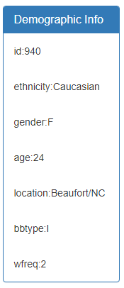
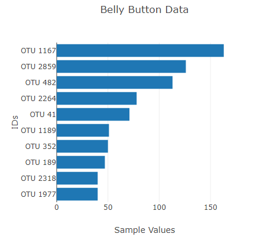
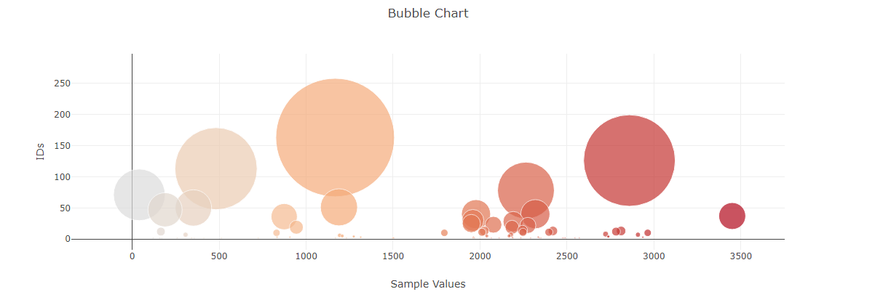

# Belly Button Bacteria

Have you ever wondered what type of microbes live in your belly button? No, I did not either. However, research was conducted on the microscopic environment and published.

This is a visualization of the different bacteria that can live in your belly button. To view the visualizations use the following link: [Belly Button Dashboard](https://kplam624.github.io/Plot.ly-challenge/). The dataset can be found [here](http://robdunnlab.com/projects/belly-button-biodiversity/), by the Rob Dunn Lab.

## Tools

---

* Javascript

* Plotly

* HTML

## Purpose

---

To create an interactive dashboard for the belly button dataset using javascript.

The visualizations is a bar chart and a bubble chart based on the OTU ids and the sample values. All plots in the dashboard are created with the help of plotly.

## Files

---

The source code can be found in the static directory under js. The index.html is the homepage for the dashboard. The dataset is in a json format under samples.json.

## Step 1: Metadata function

---

The first function to be created is the metadata.

1. Use d3 to select the `panel-primary` id.

2. Parse and filter through the json file to grab the metadata

3. Create a filter for the metadata to find one person

4. Using d3 append a `div` with a `panel-body` class.

5. Place this append function within a `Object.entries().forEach({})` method to create the metadata.

## Step 2: Bar Plot

The bar plot uses the following:

1. Use the `OTU-IDS` for the y-axis.

2. Use the `Sample-values` for the x-axis.

3. Use the `OTU-labels` for the hover text.

## Step 3: Bubble Chart

For the bubble chart

1. The `OTU-IDs` are the x-axis

2. The `Sample-Values` are the y-axis

3. The `OTU-Labels` are is the hovertext.

## Sources

---

Hulcr, J., Latimer, A. M., Henley, J. B., Rountree, N. R.**, Fierer, N., Lucky, A., Lowman, M. D., Dunn RR 2012. A jungle in there: bacteria in belly buttons are highly diverse, but predictable. PLoS ONE 7(11): e47712. doi:10.1371/journal.pone.0047712